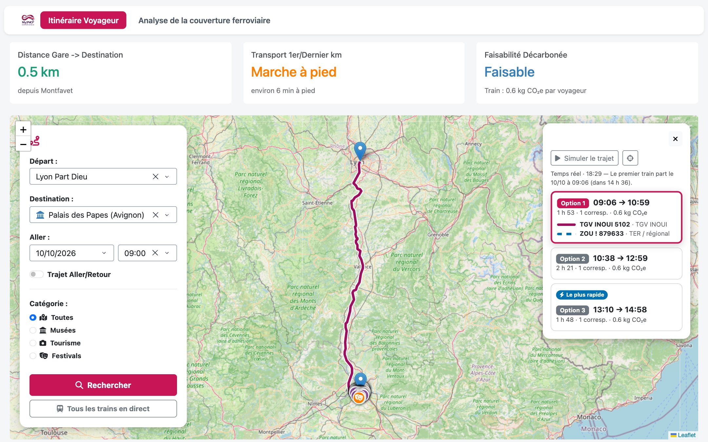
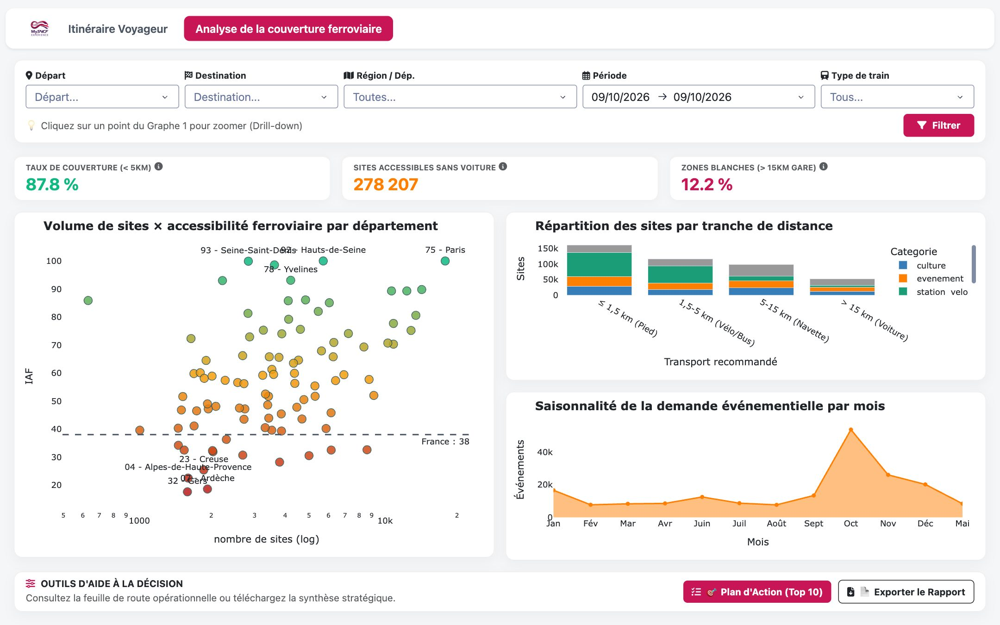

<p align="center">
  
</p>

<h1 align="center">MySNCF Experience</h1>

<p align="center">
  Aller voir un musée, un site touristique ou un festival en train : trajet, dernier kilomètre et couverture ferroviaire des territoires.
</p>

---

Un dashboard en deux onglets, construit sur les données ouvertes (SNCF, DATAtourisme, transport.data.gouv.fr…) et l'API SNCF :

- **Itinéraire voyageur** : de sa gare à un lieu ou un événement, les trains proposés, le tracé sur les voies, le dernier kilomètre
  (à pied, vélo, bus) et les trains qui roulent en direct sur la carte.
- **Analyse de la couverture ferroviaire** : quels sites touristiques sont accessibles sans voiture, par département et par distance à la gare.





## Installation

### 1. Prérequis

- Python 3.11 ou plus récent, et Git.
- Environ 20 Go d'espace disque libre, dont environ 9 Go pour la base de données et 5 Go pour l'extrait OpenStreetMap de la France (tracé des cars), une fois les données téléchargées.

### 2. Récupérer le projet

```bash
git clone https://github.com/Damien-13/MySNCF-Experience.git
cd MySNCF-Experience
```

### 3. Créer l'environnement Python

```bash
python3 -m venv .venv
source .venv/bin/activate          # Windows : .venv\Scripts\activate
pip install -r requirements.txt
```

### 4. Configurer le `.env`

```bash
cp .env.example .env               # Windows : copy .env.example .env
```

Le `.env.example` contient déjà toutes les sources de données et la base. **Une seule valeur est à renseigner : `NAVITIA_TOKEN`**, tout en haut du fichier.

Pour l'obtenir :
1. Demander une clé gratuite à l'API SNCF : [formulaire d'inscription](https://numerique.sncf.com/startup/api/token-developpeur/)
   (présentation de l'API sur [numerique.sncf.com/startup/api](https://numerique.sncf.com/startup/api/)).
2. Récupérer la clé reçue par e-mail.
3. La coller dans le `.env` : `NAVITIA_TOKEN=votre-clé`.

Le `.env` n'est jamais versionné : le token reste sur votre machine.

### 5. Créer la base et charger les données

```bash
python src/initialize.py
```

Crée la base (SQLite, `data/mysncf.db`), télécharge les sources dans `data/`, puis les nettoie et les charge.
Le premier lancement prend plusieurs dizaines de minutes. Relançable sans risque : ce qui est déjà téléchargé ou à jour n'est pas refait.

### 6. Lancer le dashboard

```bash
python src/app.py
```

Puis ouvrir [http://localhost:8050](http://localhost:8050).

### 7. Lancer les tests (facultatif)

```bash
pytest
```

## Architecture du code

```text
MySNCF-Experience/
├── src/                                            Application
│   ├── app.py                                      Dashboard Dash : mise en page des deux onglets et callbacks
│   ├── initialize.py                               Point d'entrée : crée la base, télécharge les sources, lance la transformation
│   ├── assets/                                     Fichiers chargés par le navigateur
│   │   ├── trains.js                               Animation des trains sur la carte
│   │   ├── lecture.js                              Bouton « Écouter » (voix du navigateur) et clavier
│   │   └── trains.css
│   ├── transformation/                             Nettoyage et chargement des données dans la base (un module par domaine)
│   │   ├── transformation.py                       Lance toutes les étapes dans l'ordre
│   │   ├── gare.py · culture.py · tourisme.py …    Lieux : gares, culture, tourisme, événements, vélo
│   │   ├── sncf.py · transilien.py · bus.py …      Horaires de tous les réseaux (trains, bus, tram)
│   │   ├── voies.py · trace_trajets.py             Tracé des voies et des trajets
│   │   ├── lignes_bus.py · routes.py               Lignes de bus et routes d'OpenStreetMap (tracé des cars)
│   │   └── geo.py · lieux.py                       Outils communs
│   └── EDA/                                        Notebooks d'analyse exploratoire
│
├── lib/                                            Bibliothèques réutilisées par l'application
│   ├── db/
│   │   ├── models.py                               Tables de la base (SQLAlchemy)
│   │   ├── connection.py                           Connexion (DATABASE_URL du .env)
│   │   └── write.py                                Écriture en transaction
│   ├── itineraire.py                               Logique de l'onglet Itinéraire (recherche, trajets, dernier kilomètre)
│   ├── navitia.py                                  API SNCF : gares et itinéraires
│   ├── reseau_ferre.py                             Réseau des voies et plus court chemin
│   ├── trace_bus.py · reseau_routier.py            Tracé d'un car sur la route de sa ligne, sinon arrêt par arrêt
│   ├── circulations.py                             Trains en circulation sur tout le réseau
│   ├── suivi.py                                    Position d'un train à un instant donné
│   ├── lecture.py                                  Résumés écrits de la page (lecteurs d'écran et bouton « Écouter »)
│   ├── sprites.py                                  Images des trains et des bus, à l'échelle de la carte
│   ├── flux.py                                     Flux temps réel des vélos en libre-service
│   └── downloader.py                               Téléchargement des sources dans data/
│
├── migrations/                                     Évolutions du schéma de la base (Alembic)
│   ├── migration.py
│   └── versions/                                   001_schema_initial, 002_troncon_voie, 003_trace_trajet, 004_ligne_bus, 005_troncon_route…
│
├── tests/                                          Un fichier de tests par fonctionnalité (pytest)
├── data/                                           Sources téléchargées et base générée (non versionnées)
├── assets/                                         Logo, images des trains et des bus, captures du README
├── .env.example                                    Modèle de configuration (à copier en .env)
└── requirements.txt                                Dépendances Python
```

Le code suit une séparation stricte : `lib/` ne connaît pas Dash (testable seul), `src/app.py` ne fait que l'affichage, et chaque
domaine de données a son module dans `src/transformation/`.

## Base de données

Les tables sont décrites dans `lib/db/models.py`. L'URL de la base est `DATABASE_URL` dans le `.env` (SQLite par défaut,
PostgreSQL possible en changeant l'URL).

```text
  TRANSPORT                                     EMPLACEMENTS
  ┌─────────┐                                   ┌────────────────────────┐
  │ reseau  │                                   │         lieu           │
  └────┬────┘                                   │ type : gare, arret_bus,│
       │ 1-n                                    │ station_velo, culture, │
  ┌────┴────┐                                   │ tourisme, evenement    │
  │ ligne   │                                   │ lat, lon, commune      │
  └────┬────┘                                   │ gare_proche → lieu     │
       │ 1-n                                    │ distance_gare_km       │
  ┌────┴────────┐   ┌────────────┐              └──┬──────┬──────┬───────┘
  │ circulation ├───┤ calendrier │                 │ 1-1  │ 1-1  │ n-n
  └────┬────────┘   └────────────┘                 │      │      │
       │ 1-n                                ┌──────┴──┐ ┌─┴────────────┐ ┌┴───────────────┐
  ┌────┴────┐      ┌───────┐   n-1          │  gare   │ │ station_velo │ │ evenement_lieu │
  │ passage ├─n-1──┤ arret ├───────────────►│         │ └──────────────┘ └───────┬────────┘
  └─────────┘      └───┬───┘                └────┬────┘                          │ n-1
                       │ départ / arrivée        │ 1-n                    ┌──────┴─────┐
                ┌──────┴───────┐          ┌──────┴───────┐                │ evenement  │
                │ trace_trajet │          │ gare_horaire │                └──────┬─────┘
                └──────────────┘          └──────────────┘                       │ 1-n
                  tracé du train                                       ┌─────────┴─────────┐
                  entre 2 arrêts,                                      │ evenement_periode │
                  calculé sur ───► troncon_voie (voies SNCF Réseau)    └───────────────────┘
```

- **Transport** : tous les réseaux (trains, bus, tram, métro) partagent `reseau → ligne → circulation → passage → arret`.
  Les heures de passage sont en secondes depuis minuit (elles dépassent 86 400 après minuit) ; `calendrier` donne les jours de circulation.
- **Emplacements** : tout ce qui a une position est un `lieu`, rattaché à sa gare la plus proche (`gare_proche_id`, `distance_gare_km`).
- **Tracé** : `troncon_voie` contient les voies du réseau ferré national ; `trace_trajet` en déduit le tracé entre deux arrêts consécutifs.
- **Cars** : `ligne_bus` contient les lignes de bus d'OpenStreetMap et `troncon_route` les routes entre carrefours (sans lien avec les autres tables). Un car suit sa ligne OpenStreetMap, sinon la route arrêt par arrêt, sinon une ligne droite (`lib/trace_bus.py`).

Modifier le schéma :

```bash
python migrations/migration.py                     # applique les migrations jusqu'à la plus récente
python migrations/migration.py --new "ajoute X"    # après avoir modifié lib/db/models.py : crée la migration suivante
```

Les migrations sont numérotées dans `migrations/versions/` (001, 002, 003…) : `--new` crée automatiquement le numéro suivant.
Une migration existante ne se modifie jamais : toute évolution est une nouvelle migration, à relire avant de l'appliquer.

## Données

### Sources

Chaque source est une variable `DATASET_<SOURCE>_URL` du `.env`, téléchargée dans `data/<source>/` (les `.zip` sont décompressés).
Les sources chargées par `src/initialize.py` sont la liste `SOURCES` de ce fichier ; les autres sont déclarées pour la suite du projet.

```bash
python -c "from lib.downloader import download; download(['basilic'])"   # télécharger une source seule
```

### Transformation

```bash
python src/transformation/transformation.py   # toutes les étapes dans l'ordre (chaque module se lance aussi seul)
```

| Étape | Source | Tables remplies |
|---|---|---|
| `gare.py` | gares de voyageurs, horaires des gares | `lieu`, `gare`, `gare_horaire` |
| `sncf.py` | horaires SNCF (GTFS : TGV, TER, Intercités, Ouigo, cars) | `reseau`, `ligne`, `circulation`, `calendrier`, `arret`, `passage` |
| `transilien.py` | RER et Transilien (Île-de-France Mobilités) | mêmes tables |
| `trains_europeens.py` | Eurostar, Renfe AVE, Trenitalia France | mêmes tables |
| `culture.py` | Basilic (lieux culturels) | `lieu` (culture) |
| `tourisme.py` | DATAtourisme (lieux) | `lieu` (tourisme) |
| `evenement.py` · `festival.py` | DATAtourisme (événements), festivals | `evenement`, `evenement_lieu`, `evenement_periode`, `lieu` |
| `velo.py` | stationnement cyclable, Vélib', Vélo'v | `lieu` (station_velo), `station_velo` |
| `bus.py` | 21 réseaux urbains et Île-de-France Mobilités | tables de transport |
| `voies.py` · `trace_trajets.py` | voies du réseau ferré national (SNCF Réseau) | `troncon_voie`, `trace_trajet` |
| `lignes_bus.py` | lignes de bus d'OpenStreetMap (extrait France, 5 Go) | `ligne_bus` |
| `routes.py` | routes d'OpenStreetMap où un car peut passer (extrait France) | `troncon_route` |

La transformation complète prend environ 25 minutes de plus avec le tracé des cars (`lignes_bus.py` et `routes.py` lisent chacun le fichier OpenStreetMap). La Corse et l'outre-mer sont écartés pour l'instant. Les détails de chaque étape (rattachement des arrêts aux gares, doublons
écartés…) sont dans l'en-tête de son module. Pour ajouter un domaine : créer son module avec une fonction `transformer()`, puis
l'ajouter à `ETAPES` dans `transformation.py`. Relançable sans risque : les données de chaque source sont remplacées à chaque passage.

### Données en direct (non stockées)

- **API SNCF** (`lib/navitia.py`) : itinéraires en train, retards et émissions de CO₂, avec `NAVITIA_TOKEN`. La couverture ne va qu'environ 30 jours en avant.
- **Vélos en libre-service** (`lib/flux.py`) : stations des variables `FLUX_<NOM>_URL` (GBFS v2 et v3). Un flux en panne ne bloque pas les autres.

## Lire les horaires (trains, bus, tram…)

- **Où est l'arrêt ?** `arret.lieu_id` → `lieu`. Pour un train, c'est la gare ; pour un bus, un `lieu` de type `arret_bus` avec sa gare
  la plus proche (`gare_proche_id`, à moins de 50 km).
- **Quelle ligne, vers où ?** `ligne` (nom, `type_transport`, couleur) appartient à un `reseau` ; une `circulation` est un trajet de cette ligne vers sa `destination`.
- **Quand ?** `passage` : `circulation_id`, `ordre` (1, 2, 3… le long du trajet), `arret_id`, `heure_arrivee`, `heure_depart`.
  La circulation roule les jours listés dans `calendrier` (même `service_id`).

Exemple : prochains départs d'un arrêt le 12 octobre 2026.

```sql
SELECT li.nom AS ligne, c.destination, p.heure_depart / 3600 AS h, (p.heure_depart % 3600) / 60 AS min
FROM arret a
JOIN passage p ON p.arret_id = a.id
JOIN circulation c ON c.id = p.circulation_id
JOIN ligne li ON li.id = c.ligne_id
JOIN calendrier k ON k.service_id = c.service_id AND k.date = '2026-10-12'
WHERE a.id = 'nantes_naolib:FR_NAOLIB:Quay:2299'
ORDER BY p.heure_depart;
```

## Licence

Voir [LICENSE](LICENSE).
